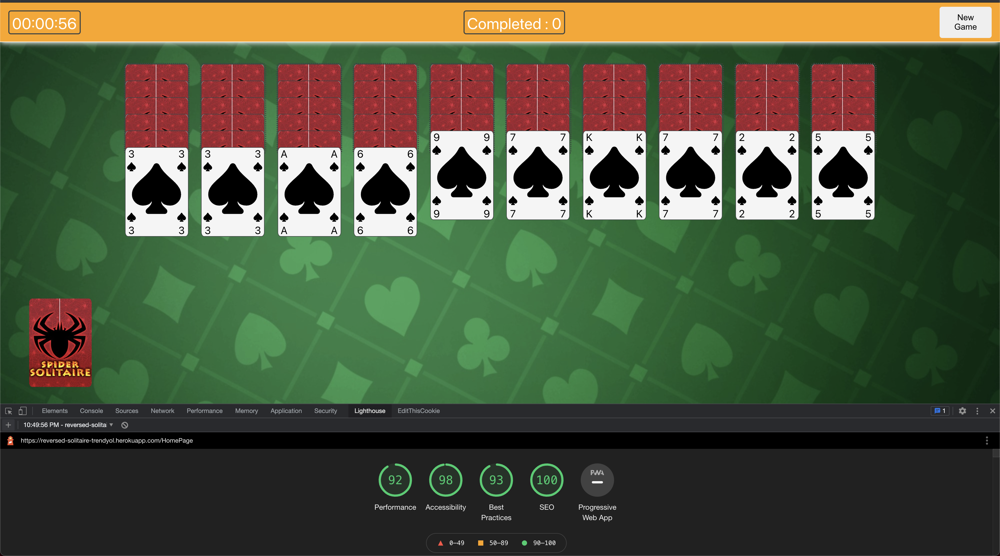
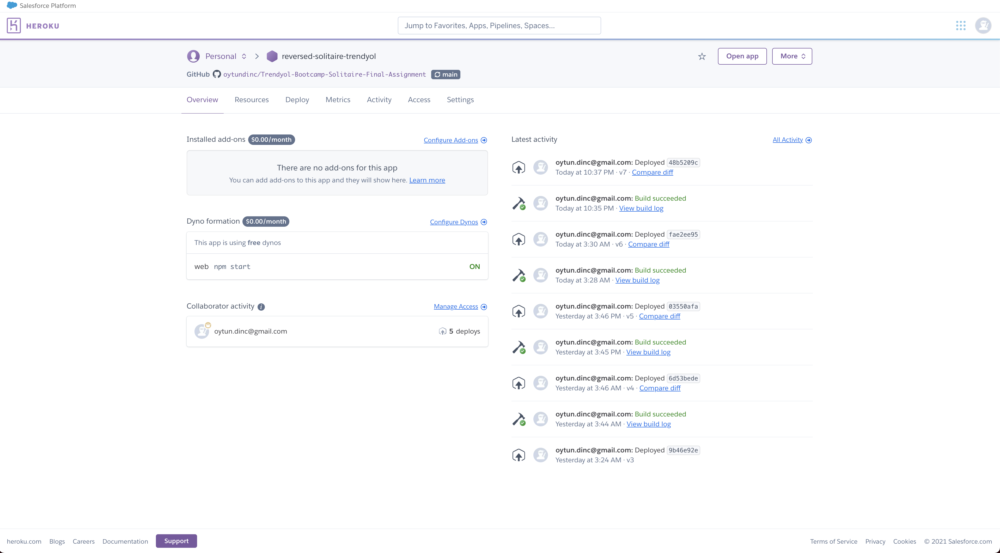

# Trendyol-Bootcamp-Solitaire-Final-Assignment


## INSTALLATION


``
git clone https://github.com/oytundinc/Trendyol-Bootcamp-Solitaire-Final-Assignment.git
```

```
npm install

npm start
```

## DEMO

[START!](https://reversed-solitaire-trendyol.herokuapp.com/)

## PREVİEW


## LİGHTHOUSE TEST



## HEROKU DEPLOYMENT


